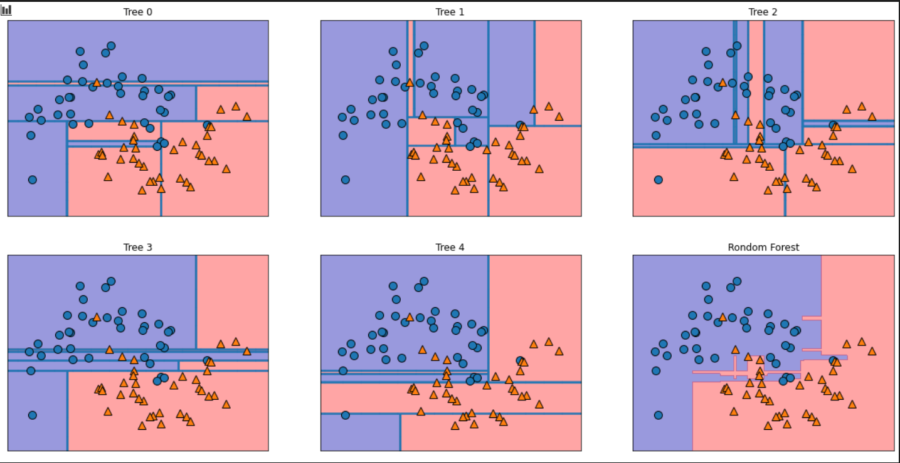

# Learn Machine Learnining

# なぜ機械学習なのか？

一部のアプリケーション、人間がモデルをよく理解できているばあには、人間が決定ルールを記述することができる。
しかし、この方法には大きく2つの問題点がある。

* ある判断を行うためのロジックが個々のタスクのドメインに作郵のものになる。タスクが少しでも変わると、システム全体を書き直さなければならないかもしれない。

* ルールを設計するには、人間のエキスパートがどのように判断しているかを深く理解している必要がある。


# 教師あり学習


教師あり学習はある入力に対して特定の出力を予測したい場合で、入出力のペアの例が入手できる際に用いられます。
入出力のペアが訓練セットとなり、それから機械学習モデルを構築します。

目的は新しい見たことのないデータに対して正確な予測を行うこと。

## クラス分類と回帰
教師あり学習問題は**クラス分類**と**回帰**に大別することができます。

それぞれの目的は以下の通り。

* クラス分類 : あらかじめ定められた選択肢の中からクラスラべルを予測すること。
  * クラス分類には、**2クラス分類**と**多クラス分類**がある。

* 回帰 : 連続値の予測すること。


クラス分類か回帰かどうかを区別するには、出力に連続性があるかどうかを確認します。


## 汎化、過学習、適合不足について

汎化とは、訓練データに基づいて構築したモデルが未見のデータに対して正確に予想できる状態。

過学習とは

適合不足とは


## 教師あり機械学習手法
個々の機械学習アルゴリズムについて記述すること

* 振る舞いについて
* メリット・デメリット
* サンプルコード


### k-最近傍法(k-NN)

#### 概要
k-最近傍法の予測では訓練データセットの中から一番近い点(値)に着目する。
予測値は最も近い点に対する値をそのまま用いる。

訓練データに含まれる点(値)の中で予測対象のデータポイントに最も近いものを最近傍点という。
近傍点は1つとは限らず、任意の個数、k個の近傍点を考えることができる。

近傍点が複数の場合の予測は、多数決で予測値が決まる。

#### サンプルコード
scikit-learn用いて、分類器の生成、分類器の訓練、テストデータの予測、モデルの評価を行う。


```python
# サンプルデータ
import mglearn
from sklearn.model_selection import train_test_split
X, y = mglearn.datasets.make_forge()

X_train, X_test, y_train, y_test = train_test_split(X, y, random_state=0)


# クラス分類器の生成
from sklearn.neighbors import KNeighborsClassifier
clf = KNeighborsClassifier(n_neighbors=3)

# 訓練セットを用いてクラス分類器を訓練
clf.fit(X_train, y_train)

# テストデータの予測
print("{}".format(clf.predict(X_test)))#予測値 : [1 0 1 0 1 0 0]

## モデルの汎化性能を評価
print("精度 : {}".format(clf.score(X_test, y_test)))#精度 : 0.8571428571428571
```

#### メリット・デメリット

メリット

* モデルが理解しやすい。
* パラメータ・距離尺度の調整をあまりしなくても十分に高い性能を持つ。

デメリット
* 訓練セット(特徴量とサンプル個数)が大きくなると予測は遅くなる。
* 大半の特徴量が0となる場合、性能が悪い。


### 線形モデル


### 決定木
[決定木](https://ja.wikipedia.org/wiki/%E6%B1%BA%E5%AE%9A%E6%9C%A8)は、クラス分類と回帰に用いられるモデルのこと。
決定木では、Yes/Noによって答えられる質問で構成された階層的な木構造を学習します。
木構造の深さが深くなればなるほど、過学習になっていいきます。(訓練セットは100%制度)

過学習を防ぐためには**事前枝刈り**と**事後枝刈り**の2つの方法があります。
* 事前枝刈り:木の深さを制限したり、葉の最大数を制限したりして、あらかじめ分割する数を決める方法
* 事後枝刈り:普通の枝刈り同様、木構造を構築した後に、深さや葉の数を制限していく方法

以下のサンプルコードでは、事前枝刈りを適用したもの。

```python

from sklearn.datasets import load_breast_cancer
from sklearn.model_selection import train_test_split
from sklearn.tree import DecisionTreeClassifier

# 乳がんの診断データがまとめられたデータセット
cancer = load_breast_cancer()
X_train, X_test, y_train, y_test = train_test_split(
    cancer.data, cancer.target, stratify=cancer.target, random_state=42)

# 木の深さを4までに制限して分類器生成
tree = DecisionTreeClassifier(max_depth=4, random_state=0)
tree.fit(X_train, y_train)

print("訓練セットの精度 : {:.2f}".format(tree.score(X_train, y_train)))# 訓練セットの精度 : 0.99
print("テストセットの精度 : {:.2f}".format(tree.score(X_test, y_test)))# テストセットの精度 : 0.95
```

#### メリット・デメリット

メリット

* モデルが簡単に可視化できる
* モデルがデータのスケールに対して変化しない

デメリット

* 過学習しやすい(事前枝刈りをしたとしても)


### 決定木のアンサンブル法

#### 概要
アンサンブル法(Ensembles)とは、複数の機械学習モデルを組み合わせてモデルを構築する方法。
ここでは、アンサンブル法の1つであるランダムフォレストを取り上げます。

ランダムフォレストは決定木が過学習しやすいという問題に対応する方法の1つです。

複数の少しずつ異なる決定木を集めて、結果の平均値をとり過学習の度合いを減らすことにより、
決定木の予測性能はそのままにして、過学習の問題を解決しようとしています。

ランダムフォレストの由来は個々の決定木が互いに異なるように、決定木の構築過程で乱数を導入していることからきています。
乱数を導入する方法は2つあり、決定木を作るためのデータポイントを選択する方法と、分岐テストに用いる特徴を選択する方法があります。

#### モデルの構築

* 構築する決定木の数を決める
* ブートストラップサンプリングを用いて新しいデータセットを作る
* 作成されたデータセットを用いて決定木を作る
  * 特徴量のサブセットをランダムに選ぶ
  * その特徴量を使うものの中から最適なテストを選択

#### 決定木とランダムフォレストを用いた予測による違い

決定木の数を5つにしてモデルを構築してみます。
5つの決定木とランダムフォレストの違いを以下に記述します。

```python
from sklearn.ensemble import RandomForestClassifier
from sklearn.datasets import make_moons
from sklearn.model_selection import train_test_split
import matplotlib.pyplot as plt
import mglearn

# サンプルデータ
X, y = make_moons(n_samples=100, noise=0.25, random_state=3)

X_train, X_test, y_train, y_test = train_test_split(X, y, stratify=y, random_state=42)

# 分類器生成
forest = RandomForestClassifier(n_estimators=5, random_state=2)
forest.fit(X_train, y_train)

#　決定木で学習された決定境界とランダムフォレストによる予測を可視化
fig , axes = plt.subplots(2, 3, figsize=(20,10))
for i, (index, tree) in enumerate(zip(axes.ravel(), forest.estimators_)):
  index.set_title("Tree {}".format(i))
  mglearn.plots.plot_tree_partition(X_train, y_train, tree, ax=index)
  
mglearn.plots.plot_2d_separator(forest, X_train, fill=True, ax=axes[-1, -1], alpha=.4)
axes[-1, -1].set_title("Rondom Forest")
mglearn.discrete_scatter(X_train[:, 0], X_train[:, 1], y_train)
```

このコードにより出力されるプロット↓



図のtree0とランダムフォレストのそれぞれの精度の確認。
```python
# treee0
print(forest.estimators_[0].score(X_train, y_train)) # 0.893 
print(forest.estimators_[0].score(X_test, y_test)) # 0.84


# ランダムフォレスト
print(forest.score(X_train, y_train)) # 0.96
print(forest.score(X_test, y_test)) # 0.92

```

#### メリット・デメリット

**メリット**

* 複雑なパラメータチューニングをせずに使える
* 強力
* データのスケール変換しなくてもよい

**デメリット**
* 高次元かつ疎なデータに対して、うまく機能しない傾向がある
* 線形モデルに比べ、メモリの消費が多く、訓練も予測も遅い


### カーネル法を用いたサポートベクターマシン


### ニューラルネットワーク

## クラス分類器の不確実性推定


